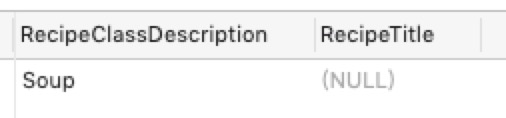

<!-- TOC -->

- [SQL 语法基础](#sql-语法基础)
    - [简单查询](#简单查询)
        - [SELECT 语法规则](#select-语法规则)
        - [去重复行](#去重复行)
        - [排序](#排序)
    - [如何获取更多信息](#如何获取更多信息)
        - [什么是表达式 -- Expression](#什么是表达式----expression)
        - [数据库中的数据类型](#数据库中的数据类型)
        - [修改数据类型：CAST 函数](#修改数据类型cast-函数)
        - [字面量](#字面量)
            - [字符串字面量](#字符串字面量)
            - [数字字面量](#数字字面量)
            - [日期时间字面量](#日期时间字面量)
        - [SQL 表达式](#sql-表达式)
            - [Concatenation 表达式](#concatenation-表达式)
            - [表达式命名](#表达式命名)
            - [Mathematical 表达式](#mathematical-表达式)
            - [Date/Time 表达式](#datetime-表达式)
        - [Null](#null)
    - [数据过滤](#数据过滤)
        - [5 种常见的断言类型](#5-种常见的断言类型)
            - [Comparison 比较](#comparison-比较)
            - [Between 区间](#between-区间)
            - [IN 成员关系](#in-成员关系)
            - [LIKE 模式匹配](#like-模式匹配)
            - [IS NULL](#is-null)
        - [WHERE 表达式](#where-表达式)
        - [条件的优先级](#条件的优先级)
        - [Less 优于 More](#less-优于-more)
    - [INNER JOIN](#inner-join)
        - [设置 Table 别名](#设置-table-别名)
        - [插入 SELECT 语句](#插入-select-语句)
        - [在 JOINs 中插入 JOINs](#在-joins-中插入-joins)
    - [OUTER JOINs](#outer-joins)
    - [参考](#参考)

<!-- /TOC -->

# SQL 语法基础

> 本文是笔者阅读《SQL Queries for Mere Mortals, 4th Edition》之后的一些总结和体会，用于做减法，便于平时查阅，如果对于 SQL 语法还不是很熟悉，那么建议大家读一下本书，相信会有所进益。

## 简单查询

### SELECT 语法规则

```sql
SELECT
	column_name 
FROM
	table_name 
WHERE
	SearchCondition 
GROUP BY
	column_name 
HAVING
	SearchCondition
```

其中 column_name 可以通过逗号隔开，从而匹配多个字段。

### 去重复行

```sql
SELECT DISTINCT column_name FROM table_name
```

### 排序

```sql
SELECT Statement ORDER BY column_name ASC/DESC
```

ASC 为从小到大排序， DESC 为从大到小排序，且 ORDER BY 语法不会改变 table 原本的顺序。

## 如何获取更多信息

### 什么是表达式 -- Expression

> 如果不仅仅要获取简单的列信息，那么你将需要使用表达式。

在很多时候，我们不仅仅只是需要将列的值筛选出来，有时候我们可能需要知道一些额外的信息，例如：

- 数据的总数

- 通过开始时间和结束时间获取时间间隔

- 根据订单估算每小时的成交率

### 数据库中的数据类型

数据库中的数据类型主要有 7 大类：

- **character**: 分为固定长度（`CHARACTER`/`CHAR`）和可变长度（`CHARACTER VARYING`/`CHAR VARYING`/`VARCHAR`），最大字符长度由数据库决定。当字符长度超出系统定义的最大长度时（通常是 255 或者 1,024 个字符），我们需要使用 `CHARACTER LARGE OBJECT`,  `CHAR LARGE OBJECT` 或者是 `CLOB`，在许多系统中，`CLOB` 的别名为 `TEXT` 或 `MEMO`。

- **national character**: 大多数特性与 `character` 类似，主要作用是为了增强 oracle 的字符处理能力，因为 `NCHAR` 数据类型可以提供对亚洲使用定长多字节编码的支持，而数据库字符集则不能。包括 `NCHAR`, `NVARCHAR2`, `NCLOB`。

- **binary**: 使用 `BINARY LARGE OBJECT` 或 `BLOB` 来存储二进制数据，例如图片，音频，视频，或是复杂的嵌入式文件，如 word 等

- **exact numeric**: 确数集合，包括 `NUMERIC`, `DECIMAL`, `DEC`, `SMALLINT`, `INTEGER`, `INT`, 和 `BIGINT`。

- **approximate numeric**: 约数集合，包括 `FLOAT`, `REAL`, and `DOUBLE PRECISION`

- **Boolean**: `true` or `false`

- **datetime**: 保存日期，时间，或是两者的组合类型，包括 `DATE`, `TIME`, 和 `TIMESTAMP` 。

- **interval**: 用于存储时间间隔，如 year, month, day, time，包括 `INTERVAL`。

许多数据库也会提供一些扩展数据类型，例如 `MONEY/CURRENCY` 和 `SERIAL/ROWID/AUTOINCREMENT/IDENTITY` 等

### 修改数据类型：CAST 函数

CAST 函数用于将字面量或列中的值转化为特定的数据类型。语法为：

```sql
CAST (expression AS data_type)
```

- expression: SQLServer 表达式；
- AS：用于分割待处理的数据和要转换的数据类型；
- data_type: 要转换的数据类型

举个栗子：

```sql
SELECT CAST('3.141' AS DECIMAL(10,2))
```

结果为：3.14
> 注意：原来的 '3.141' 会对第三个小数位进行四舍五入。

### 字面量

#### 字符串字面量

用**单引号**包裹的字符序列，下面我们来感受一下具体的应用。

当执行

```sql
SELECT VendWebPage, VendName FROM Vendors
```

时，我们的结果是这样的：


我们可以增加说明字符串：

```sql
SELECT VendWebPage, 'is the Web site for', VendName FROM Vendors
```

结果为：


显然，对于含义不是很清晰的查询结果，增加字符串描述能够有效的提高 SQL 结果的可读性。

#### 数字字面量

```
427
-11.252
.532 0.3E-3
```

#### 日期时间字面量

- DATE: YY-MM-DD，有些数据库也会使用 MM/DD/YY 的形式，具体需要根据数据库文档来确定

- TIME: hh:mm:ss

- TIMESTAMP: 时间戳

### SQL 表达式

#### Concatenation 表达式

由于笔者使用的是 MySQL 数据库，因此这里的 Concatenation 表达式需要借助函数 CONCAT 来实现，

```sql
SELECT CONCAT(EmpFirstName, ' ', EmpLastName) , CONCAT('Phone Number: ', EmpPhoneNumber) FROM Employees
```

结果为：


#### 表达式命名

范式：`SELECT expression AS column_name ->`

此前的 sql 语句可以修改为：

```sql
SELECT
	CONCAT( EmpFirstName, ' ', EmpLastName ) AS EmployeeName,
	CONCAT( 'Phone Number: ', EmpPhoneNumber ) AS EmpPhoneNumber 
FROM
	Employees
```


#### Mathematical 表达式

```sql
SELECT
	CONCAT( AgtFirstName, ' ', AgtLastName ) AS AgentName,
	Salary + ( 50000 * CommissionRate ) AS ProjectedIncome 
FROM
	Agents
```


#### Date/Time 表达式

```sql
SELECT OrderNumber, DATEDIFF(ShipDate,OrderDate) AS DaysToShip FROM Orders
```

这里我们使用了 MySQL 提供的 `DATEDIFF` 函数来计算时间间隔，事实上不同的数据库都提供了各自的日期函数，非常便捷。


### Null

Null 在数据库中表示没有值，或者未知数据

## 数据过滤

### 5 种常见的断言类型

#### Comparison 比较

1. = 等于
2. <> 不等于
3. < 小于
4. \> 大于
5. <= 小于等于
6. \>= 大于等于

#### Between 区间

通常用 AND 连接符连接两个数值

#### IN 成员关系

用于判断给定值是否匹配给定列表中的每一项

#### LIKE 模式匹配

用于判断一个字符串表达式是否匹配特定的字符串样式。这里着重介绍两个特殊符号 `%` 和 `_`：

1. %：表示 0 或多个任意字符

2. _: 表示 1 个任意字符

举个例子：

'Sha%' -> **Sha**nnon, **Sha**wn
'Ro_' -> **Ro**b, **Ro**y

当需要匹配的字符串是 MX_445这样的值时，我们需要使用 LIKE 的 ESCAPE 选项：

```sql
SELECT ProductName, ProductCode FROM Products WHERE ProductCode LIKE 'G\_00_' ESCAPE '\'
```

当我们将 `\` 定义为 ESCAPE 后，数据库系统会将该字符忽略，并对其后面的第一个字符取字面量。

#### IS NULL

判断值是否为 null

### WHERE 表达式

```sql
SELECT CustFirstName, CustLastName FROM Customers WHERE CustState = 'WA'

SELECT CustFirstName, CustLastName FROM Customers WHERE CustState = 'WA' AND CustState = 'MA'

SELECT CustFirstName, CustLastName FROM Customers WHERE CustState = 'WA' OR CustState = 'MA'

SELECT FirstName, LastName FROM Staff WHERE DateHired BETWEEN '1986-07-01' AND '1986-07-31'

SELECT FirstName, LastName FROM Staff WHERE DateHired NOT BETWEEN '1986-07-01' AND '1986-07-31'

SELECT CustLastName, CustirstName From Customers WHERE CustLastName LIKE 'Mar%'
```

### 条件的优先级

我们在使用条件语句时，各条件出现的顺序也会影响到数据库的执行过程。来看一个例子：

```sql
SELECT CustomerID, OrderDate, ShipDate FROM Orders WHERE ShipDate = OrderDate AND CustomerID = 1001
```

默认情况下，数据库会按照从左到右的顺序执行条件语句，也就是说会先找到 ShipDate = OrderDate 的所有行，然后再筛选出这些行中包含 CustomerID = 1001 的所有行。

但是当条件语句中包含更多类型的连接符时，就需要遵循一定的优先级顺序了，具体优先级从高到低为：

1. 正负号 +/- -> 
2. *,/ 
3. 加减号 +/- 
4. =,<>,<,>,<=,>=,BETWEEN,IN,LIKE,IS NULL
5. NOT
6. AND
7. OR

当然，为了更清晰的表明查询的先后顺序，我们还是尽量用圆括号来消除歧义。

### Less 优于 More

回到此前的一个 SQL 语句：

```sql
SELECT
	CustomerID,
	OrderDate,
	ShipDate 
FROM
	Orders 
WHERE
	ShipDate = OrderDate 
	AND CustomerID = 1001
```

由于 ShipDate = OrderDate 条件更加复杂，而 CustomerID = 1001 则更简单明确，且能排除掉更多的数据，因此应该将 CustomerID = 1001 放到前面：

```sql
SELECT
	CustomerID,
	OrderDate,
	ShipDate 
FROM
	Orders 
WHERE
	CustomerID = 1001 
	AND ShipDate = OrderDate
```

## INNER JOIN

> 连接结果仅包含符合连接条件的行，参与连接的两个表都应该符合连接条件。

语法结构：


举个例子：

```sql
SELECT
	RecipeTitle,
	Preparation,
	RecipeClassDescription 
FROM
	Recipe_Classes
	INNER JOIN Recipes ON Recipe_Classes.RecipeClassID = Recipes.RecipeClassID
```

这样就能将 Recipe_Classes 和 Recipes 两张表中的字段进行组合，从而实现联合查询，查询条件的连接符为 ON ，有点类似于单表查询的 WHERE，查询条件为 `Recipe_Classes.RecipeClassID = Recipes.RecipeClassID` 即通过 RecipeClassID 字段进行关联。

为了表示更加清晰，我们可以为每个列增加所属表名：

```sql
SELECT
	Recipes.RecipeTitle,
	Recipes.Preparation,
	Recipe_Classes.RecipeClassDescription 
FROM
	Recipe_Classes
	INNER JOIN Recipes ON Recipe_Classes.RecipeClassID = Recipes.RecipeClassID
```

注意：有些数据库系统可能并没有提供 JOIN 关键字，但没有关系，在类数据库中我们可以使用 WHERE 语法：

```sql
SELECT
	Recipes.RecipeTitle,
	Recipes.Preparation,
	Recipe_Classes.RecipeClassDescription 
FROM
	Recipe_Classes,
	Recipes 
WHERE
	Recipe_Classes.RecipeClassID = Recipes.RecipeClassID
```

效果是一样的，此外，像 MySQL 等数据库，实际上两种语法都是支持的。

最终查询结果为：


### 设置 Table 别名

使用 AS 语法：

```sql
SELECT R.RecipeTitle, R.Preparation, RC.RecipeClassDescription FROM Recipe_Classes AS RC INNER JOIN Recipes AS R ON RC.RecipeClassID = R.RecipeClassID
```

### 插入 SELECT 语句

```sql
SELECT
	R.RecipeTitle,
	R.Preparation,
	RCFiltered.ClassName 
FROM
	(
	SELECT
		RecipeClassID,
		RecipeClassDescription AS ClassName 
	FROM
		Recipe_Classes AS RC 
	WHERE
		RC.RecipeClassDescription = 'Main course' 
		OR RC.RecipeClassDescription = 'Dessert' 
	) AS RCFiltered
	INNER JOIN Recipes AS R ON RCFiltered.RecipeClassID = R.RecipeClassID
```

### 在 JOINs 中插入 JOINs

```sql
SELECT Recipe_Classes.RecipeClassDescription, Recipes.RecipeTitle, Recipes.Preparation, Ingredients.IngredientName, Recipe_Ingredients.RecipeSeqNo, Recipe_Ingredients.Amount, Measurements.MeasurementDescription
FROM
	(
		(
			(
				Recipe_Classes INNER JOIN Recipes ON Recipe_Classes.RecipeClassID = Recipes.RecipeClassID 
			) INNER JOIN Recipe_Ingredients ON Recipes.RecipeID = Recipe_Ingredients.RecipeID 
		) INNER JOIN Ingredients ON Ingredients.IngredientID = Recipe_Ingredients.IngredientID 
	) INNER JOIN Measurements ON Measurements.MeasureAmountID = Recipe_Ingredients.MeasureAmountID  ORDER BY RecipeTitle, RecipeSeqNo
```

## OUTER JOINs

> 连接结果不仅包含符合连接条件的行同时也包含自身不符合条件的行。包括左外连接、右外连接和全外连接。

- **左外连接**：左边表数据行全部保留，右边表保留符合连接条件的行。

- **右外连接**：右边表数据行全部保留，左边表保留符合连接条件的行。

- **全外连接**：左外连接 union 右外连接。

接下来我们以左外连接为例，来说明其特点。

1. 展示所有食谱类型及其所对应的食谱。

```sql
SELECT
	Recipe_Classes.RecipeClassDescription,
	Recipes.RecipeTitle 
FROM
	Recipe_Classes
	LEFT OUTER JOIN Recipes ON Recipe_Classes.RecipeClassID = Recipes.RecipeClassID
```


2. 展示所有还未有任何相应食谱的食谱类型。

```sql
SELECT
	Recipe_Classes.RecipeClassDescription,
	Recipes.RecipeTitle 
FROM
	Recipe_Classes
	LEFT OUTER JOIN Recipes ON Recipe_Classes.RecipeClassID = Recipes.RecipeClassID 
WHERE
	Recipes.RecipeID IS NULL
```



## 参考
