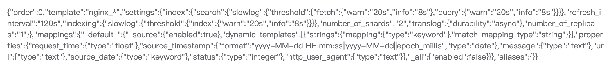

# 格式化展示`JSON`字符串

最近遇到一个需求，需要前端将后台返回的`JSON`串格式化显示出来。要知道，如果我们直接将返回的字符串输出到屏幕上，我们能看到的仅仅只是一串普通文本，像这样：



这么看`JSON`对象估计会让所有人崩溃~~.那么首先我们就需要让其能够保留`JSON`结构，经过一番查找，悍然发现原来我们的`JSON.stringify`方法可以对`JSON`对象进行格式化输出，先来看一下官方给出的语法：

```js
JSON.stringify(value[, replacer[, space]])
```
这里把官方的介绍贴一下，方便大家参考：

- **value**: 必需， 要转换的 JavaScript 值（通常为对象或数组）。

- **replacer**: 可选。用于转换结果的函数或数组。
如果 replacer 为函数，则 JSON.stringify 将调用该函数，并传入每个成员的键和值。使用返回值而不是原始值。如果此函数返回 undefined，则排除成员。根对象的键是一个空字符串：""。
如果 replacer 是一个数组，则仅转换该数组中具有键值的成员。成员的转换顺序与键在数组中的顺序一样。

- **space**: 可选，文本添加缩进、空格和换行符，如果 space 是一个数字，则返回值文本在每个级别缩进指定数目的空格，如果 space 大于 10，则文本缩进 10 个空格。space 也可以使用非数字，如：\t。

看起来`space`参数正符合我们的要求，具体方法如下：

```js
JSON.stringify(JSON.parse(jsonstr), undefined, 4)
```

似乎一切就绪，但在实际开发的时候又遇到了一个小坑，我在输出到页面时未能显示出期望的效果，代码如下：

```html
<el-dialog>
    {{jsonStr}}
</el-dialog>
```

后来又尝试了`<div v-html="jsonStr"></div>`，还是没有变化，这时候，我想到了`<pre>`。
**`<pre>`标签可定义预格式化的文本。被包围在 `<pre>` 标签 元素中的文本通常会保留空格和换行符。而文本也会呈现为等宽字体。**。尝试一下：

```html
<el-dialog>
    <pre v-html="jsonStr"></pre>
</el-dialog>
```

输出结果为：


看起来人性化多了，但所有字段都是一个颜色，结构还是不够清晰，接下来就需要使用语法高亮了，这里使用了[stackoverflow的一个答案](https://stackoverflow.com/a/7220510)：

```js
const syntaxHighlight = (json) => {
    json = json.replace(/&/g, '&amp;').replace(/</g, '&lt;').replace(/>/g, '&gt;').replace(/\n/g,"<br/>");
    return json.replace(/("(\\u[a-zA-Z0-9]{4}|\\[^u]|[^\\"])*"(\s*:)?|\b(true|false|null)\b|-?\d+(?:\.\d*)?(?:[eE][+\-]?\d+)?)/g, function (match) {
        var cls = 'number';
        if (/^"/.test(match)) {
            if (/:$/.test(match)) {
                cls = 'key';
            } else {
                cls = 'string';
            }
        } else if (/true|false/.test(match)) {
            cls = 'boolean';
        } else if (/null/.test(match)) {
            cls = 'null';
        }
        return '<span class="' + cls + '">' + match + '</span>';
    });
};
```

使用`computed`属性：

```js
computed: {
    jsonStr: function(){
        const json = this.dataSource && JSON.parse(this.dataSource)
        return syntaxHighlight(JSON.stringify(json , undefined, 4))
    }
},
```

最终效果如下：


诶哟，不错哦～