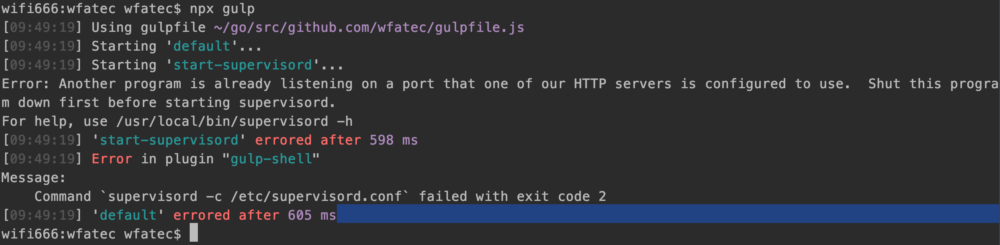
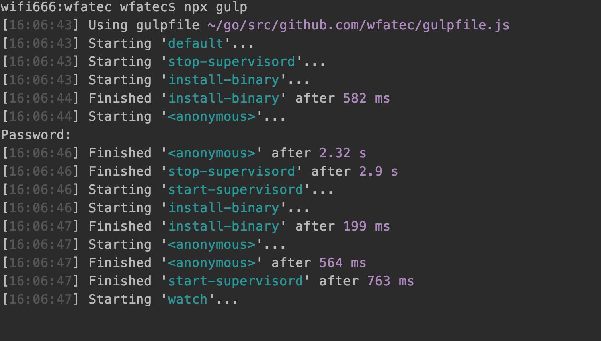

<!-- TOC -->

- [Gulp](#gulp)
    - [Gulp4 和 Gulp3](#gulp4-和-gulp3)
    - [安装](#安装)
    - [配置](#配置)
    - [执行](#执行)

<!-- /TOC -->

# Gulp

Gulp 对于大前端领域来讲已经称得上是大名鼎鼎工作流管理工具了，虽然这几年由于 webpack 的兴起，有一定的下滑，但在特定的场景下仍是无可匹敌的。事实上，Gulp 并不仅仅可以管理 JS 或 NodeJS 项目，对于其它语言的项目同样可以使用 Gulp 来进行工作流的管理，下面我将以 Golang 项目为例进行简单的实践。

## Gulp4 和 Gulp3

由于这里使用的是 `Gulp4` 以上的版本，该版本在书写任务队列时，与 `Gulp3` 存在较大差异，例如：

在 Gulp3 中，如果要依次执行一个任务 A，B，C 的任务队列，可以这样做：

```js
gulp.task('A', () => {
  // Do something.
});
gulp.task('B', ['A'], () => {
  // Do some stuff.
});
gulp.task('C', ['B'], () => {
    // Do some more stuff.
});
```

但在 Gulp4 中将会报错：

```
assert.js:85
  throw new assert.AssertionError({
  ^
AssertionError: Task function must be specified
```
在 `Gulp4`中 需要通过 `gulp.series` 和 `gulp.parallel` 来指定依赖任务：

- `gulp.series`：顺序执行
- `gulp.paralle`：并行执行

```js
gulp.task('series-task', gulp.series('A', 'B', 'C', () => {
  // 依次执行 A B C， 之后再进行操作
}));
```

```js
gulp.task('parallel-task', gulp.parallel('A', 'B', 'C', () => {
  // 同时执行 A B C ，之后再进行操作
}));
```

## 安装

安装 Gulp 主要有全局安装和局部安装两种方式，由于 npx 的出现，我们完全可以抛弃全局安装的方式，从而实现更好的依赖管理。在安装前需要确保本地安装了 node 环境，可以通过`node --version`进行查看，我当前的 node 版本为 `v10.8.0` 仅供参考。

在项目根目录下执行如下命令：

```
npm install gulp
```

安装完成后会在当前目录生成`package.json`文件以及`node_modules`文件夹，具体含义可以自行查阅，这里就不赘述了。

此外，由于我们需要执行 shell 来执行相关命令，因此还需要安装 `gulp-shell`：

```
npm install gulp-shell
```

## 配置

加下来我们就要编写 Gulp 的配置文件 `gulpfile.js` ：

```js
const gulp = require("gulp");
const shell = require("gulp-shell");

gulp.task("install-binary", shell.task([
    'go install github.com/wfatec/romanserver'
]));

gulp.task("restart-supervisor", gulp.series("install-binary", shell.task([
    'supervisorctl restart myserver'
])));

gulp.task("watch", () => {
    gulp.watch("./romanserver/*", gulp.series('install-binary', 'restart-supervisor'));
});

gulp.task('default', gulp.series("watch"));

```

此时，当 romanserver 文件夹内容发生修改时，将重新 `install` Golang 项目，并重启 supervisord。但当电脑发生重启时， `watch` 任务在执行过程中发生了错误，错误信息为 `restart-supervisor` 出错。后来发现时未能先执行 `supervisord -c /etc/supervisord.conf` 来启动 supervisord。因此即决方案自然而然就想到了增加一个启动 supervisord 的 task：

```js

// 新增启动 supervisord task
gulp.task("start-supervisord", shell.task([
    'supervisord -c /etc/supervisord.conf'
]))

// 修改 default task
gulp.task('default', gulp.series("start-supervisord", "watch"));
```

果然不再报错。但是又有一个问题，如果我在还未 `install` 的时候执行 `gulp` ，由于找不到 `$GPPATH/bin/romanserver` 文件，不是同样会发生问题吗？试一下，首先删除 `$GPPATH/bin/romanserver` 文件，重新执行 `npx gulp`。结果：



可以看到，果然发生了错误，因此，我们在执行 supervisord 之前，还需要先进行 `install`! 继续修改：

```js
gulp.task("start-supervisord",  gulp.series("install-binary", shell.task([
    'supervisord -c /etc/supervisord.conf'
])));
```

执行 `npx gulp` 结果依然报错：


看起来是某个端口发生了冲突，那我们就先关闭所有服务：

```js
gulp.task("stop-supervisord",  gulp.series("install-binary", shell.task([
    'supervisorctl stop all'
])));

gulp.task('default', gulp.series("stop-supervisord", "start-supervisord", 'watch'));
```

结果还是相同的错误，那么就只可能是 supervisor 服务本身发生了冲突，因此需要在启动前关闭已有的 supervisor 服务。那么怎么关闭呢？

参考[Supervisor on Debian Wheezy: another program is already listening on a port that one of our HTTP servers is configured to use
](https://stackoverflow.com/questions/25121838/supervisor-on-debian-wheezy-another-program-is-already-listening-on-a-port-that/25200328)

先去查看配置文件 `supervisord.conf`，可以看到：

```
[unix_http_server]
file=/usr/local/var/run/supervisor.sock   ; the path to the socket file
```

因此将 task `stop-supervisord` 修改为：

```js
gulp.task("stop-supervisord",  gulp.series("install-binary", shell.task([
    'sudo unlink /usr/local/var/run/supervisor.sock'
])));
```

执行 `npx gulp`，终于可以正常启动！

最终得到 `gulpfile.js` 文件内容如下：

```js
const gulp = require("gulp");
const shell = require("gulp-shell");

gulp.task("install-binary", shell.task([
    'go install github.com/wfatec/romanserver'
]));

gulp.task("restart-supervisor", gulp.series("install-binary", shell.task([
    'supervisorctl restart myserver'
])));

gulp.task("watch", () => {
    gulp.watch("./romanserver/*", gulp.series('install-binary', 'restart-supervisor'));
});

gulp.task("start-supervisord",  gulp.series("install-binary", shell.task([
    'supervisord -c /etc/supervisord.conf'
])));

gulp.task("stop-supervisord",  gulp.series("install-binary", shell.task([
    'sudo unlink /usr/local/var/run/supervisor.sock'
])));

gulp.task('default', gulp.series("stop-supervisord", "start-supervisord", 'watch'));
```


## 执行

在终端执行：

```
npx gulp
```

结果为：



可见，每次修改 `romanserver` 下的文件时，都会执行我们配置好的工作流，实现了开发过程中的自动化构建流程。

**注意**：由于关闭 supervisor 时需要手动输入密码进行确认，所以会有一个密码输入确认操作，之后的 watch 阶段将完全由 Gulp 自动实现。