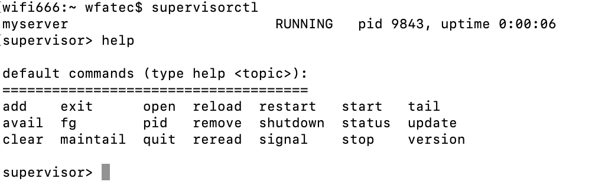

# supervisor

有时我们的 web 应用可能会随着操作系统的重启或程序崩溃而意外停止，这时如果始终由运维人员手动重启会造成严重的滞后问题，进而影响公司的正常运营，带来严重的经济损失。**supervisor** 就是为了解决这一痛点而存在的，即使系统进行了重启，一旦 web 服务被终止，它将自动重启服务。

## 安装

- mac 系统：

```
brew install supervisor
```

- Ubuntu 16.04:

```
sudo apt-get install -y supervisor
```

其它系统请自行查阅[官网教程](http://supervisord.org/)。

> 由于本人使用的是 mac ，因此将以此环境为例进行介绍。

## 配置

为了便于说明，这里简单用 go 实现了一个 web 服务，并已经进行了 `install` 我们可以直接在 `$GOPATH` 下的 bin 文件夹下找到编译后的可执行文件 `romanserver`。

- 创建配置文件 `/etc/supervisor/conf.d/goproject.conf`

- 在配置文件中增加配置项：

```conf
[supervisord]
logfile = /tmp/supervisord.log

[program:myserver]              # myserver 是需要管理的进程的名字
command=/[$GOPATH]/bin/romanserver # 需要执行的命令
autostart=true                  # 设置自动开启,开启supervisor时进程就开启了
autorestart=true                # 设置自动重启,进程终止后自动重启
```

其中 `[supervisord]` 区块定义 log 文件的地址，`[program:myserver]` 则是 task 区块，将转移到指定的目录去执行给定的命令。

**注意**：要使配置文件生效,需要将自己的配置文件路径包含到 supervisor 的配置当中。这个配置在不同系统下位置有所区别。

- 输出初始化文件到配置文件里，确保你的权限

```
echo_supervisord_conf > /etc/supervisord.conf
```

> 运行 supervisord 服务的时候，需要指定 supervisor 配置文件，如果没有显示指定，默认在以下目录查找：

```
$CWD/supervisord.conf
$CWD/etc/supervisord.conf
/etc/supervisord.conf
/etc/supervisor/supervisord.conf (since Supervisor 3.3.0)
../etc/supervisord.conf (Relative to the executable)
../supervisord.conf (Relative to the executable)
```

$CWD 表示运行 supervisord 程序的目录。

配置文件参数说明：

```
[unix_http_server]
file=/tmp/supervisor.sock   ;UNIX socket 文件，supervisorctl 会使用
;chmod=0700                 ;socket文件的mode，默认是0700
;chown=nobody:nogroup       ;socket文件的owner，格式：uid:gid

;[inet_http_server]         ;HTTP服务器，提供web管理界面
;port=127.0.0.1:9001        ;Web管理后台运行的IP和端口，如果开放到公网，需要注意安全性
;username=user              ;登录管理后台的用户名
;password=123               ;登录管理后台的密码

[supervisord]
logfile=/tmp/supervisord.log ;日志文件，默认是 $CWD/supervisord.log
logfile_maxbytes=50MB        ;日志文件大小，超出会rotate，默认 50MB，如果设成0，表示不限制大小
logfile_backups=10           ;日志文件保留备份数量默认10，设为0表示不备份
loglevel=info                ;日志级别，默认info，其它: debug,warn,trace
pidfile=/tmp/supervisord.pid ;pid 文件
nodaemon=false               ;是否在前台启动，默认是false，即以 daemon 的方式启动
minfds=1024                  ;可以打开的文件描述符的最小值，默认 1024
minprocs=200                 ;可以打开的进程数的最小值，默认 200

[supervisorctl]
serverurl=unix:///tmp/supervisor.sock ;通过UNIX socket连接supervisord，路径与unix_http_server部分的file一致
;serverurl=http://127.0.0.1:9001 ; 通过HTTP的方式连接supervisord

; [program:xx]是被管理的进程配置参数，xx是进程的名称
[program:xx]
command=/opt/apache-tomcat-8.0.35/bin/catalina.sh run  ; 程序启动命令
autostart=true       ; 在supervisord启动的时候也自动启动
startsecs=10         ; 启动10秒后没有异常退出，就表示进程正常启动了，默认为1秒
autorestart=true     ; 程序退出后自动重启,可选值：[unexpected,true,false]，默认为unexpected，表示进程意外杀死后才重启
startretries=3       ; 启动失败自动重试次数，默认是3
user=tomcat          ; 用哪个用户启动进程，默认是root
priority=999         ; 进程启动优先级，默认999，值小的优先启动
redirect_stderr=true ; 把stderr重定向到stdout，默认false
stdout_logfile_maxbytes=20MB  ; stdout 日志文件大小，默认50MB
stdout_logfile_backups = 20   ; stdout 日志文件备份数，默认是10
; stdout 日志文件，需要注意当指定目录不存在时无法正常启动，所以需要手动创建目录（supervisord 会自动创建日志文件）
stdout_logfile=/opt/apache-tomcat-8.0.35/logs/catalina.out
stopasgroup=false     ;默认为false,进程被杀死时，是否向这个进程组发送stop信号，包括子进程
killasgroup=false     ;默认为false，向进程组发送kill信号，包括子进程

;包含其它配置文件
[include]
files = relative/directory/*.ini    ;可以指定一个或多个以.ini结束的配置文件
```

修改 `supervisord.conf` 将最下方 `[include]` 字段修改为:

```conf
[include]
files = /etc/supervisor/conf.d/*.conf
```

## 启动

supervisord -c 启动配置文件

```
supervisord -c /etc/supervisor/supervisord.conf
```

通过 `supervisorctl` 重新读取配置文件并重启 tasks(proccess)。

- supervisorctl reload
- supervisorctl update

最后执行：

- supervisorctl

结果如下：



## 常用命令

```conf
supervisorctl status #查看所管理的进程状态
# 在修改好配置文件之后使用下面两个命令进行更新
supervisorctl reread  
supervisorctl update
#重新启动配置中的所有程序
supervisorctl reload  
启动某个进程(program_name=你配置中写的程序名称)
supervisorctl start program_name  
查看正在管理的进程
supervisorctl  
# 停止某一进程 (program_name=你配置中写的程序名称)
supervisorctl stop program_name  
# 停止全部进程
supervisorctl stop all  
```

## 常见的错误

请参考 [supervisor常见报错](https://blog.csdn.net/kkevinyang/article/details/80539940)

基本解决了我所遇到的问题～
